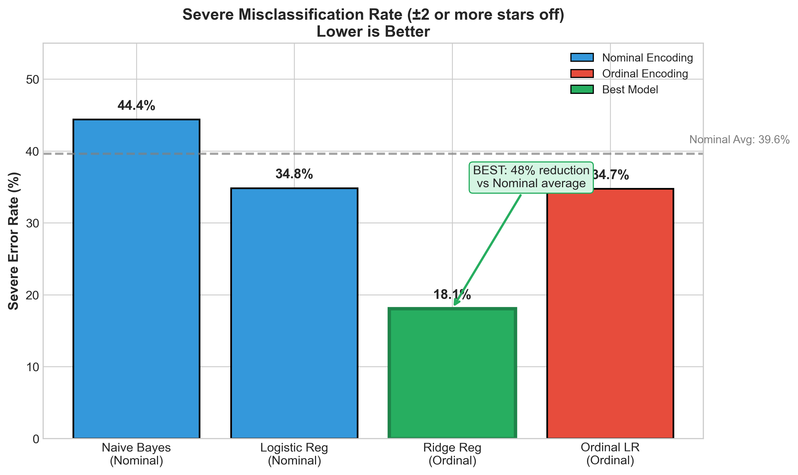
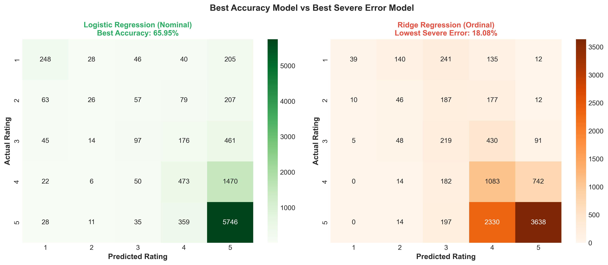
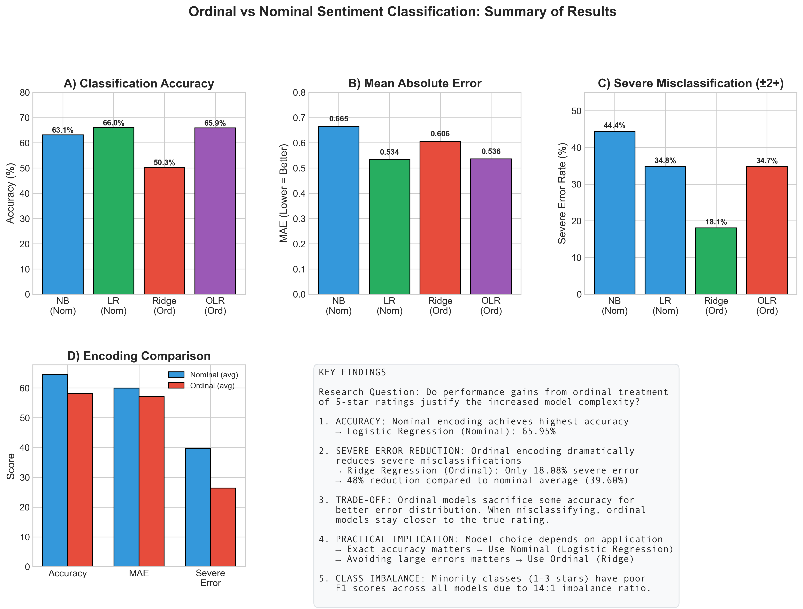

# Ordinal vs Nominal Sentiment Classification

A comparison of ordinal and nominal classifiers for 5-star Amazon review
prediction. Tests whether treating ratings as ordered values (1 < 2 < … < 5)
reduces severe-error rates relative to standard multiclass classification.

**Author:** Atharv Chaudhary (CS 5100 — Foundations of AI, Northeastern University)

## Key finding

When a 1-star review is misclassified, the *type* of error matters. Predicting
it as 2 stars is much less wrong than predicting 5 stars. The ordinal models
exploit this directly.

- Best top-line accuracy: **Logistic Regression (Nominal)** at 66.10%, MAE 0.5315.
- Best severe-error rate: **Ridge Regression (Ordinal)** at 18.1% — roughly half
  the rate of the nominal classifiers (35–44%), at the cost of about 16
  accuracy points.

Ordinal models trade raw accuracy for substantially safer mistakes.



## Dataset

Stanford SNAP **Amazon Reviews — Electronics 5-core**
(`reviews_Electronics_5.json.gz`).

- ~1.69M reviews of electronics products, May 1999 to July 2014
- 5-core: each user has at least 5 reviews and each item has at least 5 reviews
- Source: http://snap.stanford.edu/data/amazon/productGraph/categoryFiles/

The pipeline reads the first 50,000 records (`SAMPLE_SIZE = 50000` in
`1_Data_Loading.ipynb`), reduces to `(text, rating)`, drops reviews shorter
than 10 characters or with rating outside [1, 5], and saves the cleaned set
of 49,961 reviews to `data/amazon_electronics_cleaned.csv`.

## Models

Four shallow classifiers on TF-IDF features.

Nominal (ratings treated as unordered classes):
- Multinomial Naive Bayes
- Multinomial Logistic Regression

Ordinal (ratings treated as ordered values):
- Ridge Regression with rounded-integer prediction
- Ordinal Logistic Regression with cumulative-probability thresholds

## Results

| Model | Encoding | Accuracy | MAE | F1 Macro | Severe Error |
|---|---|---:|---:|---:|---:|
| Naive Bayes | Nominal | 63.14% | 0.6646 | 0.2322 | 44.4% |
| Logistic Regression | Nominal | **66.10%** | **0.5315** | 0.3816 | 34.8% |
| Ridge Regression | Ordinal | 50.34% | 0.6051 | 0.3077 | **18.1%** |
| Ordinal Logistic Regression | Ordinal | 65.85% | 0.5359 | 0.3713 | 34.8% |

Severe error = the prediction is off by 2 or more stars.





## Run


```bash
pip install -r requirements.txt
```


Then execute the notebooks in order:

1. `notebooks/1_Data_Loading.ipynb` — fetch and clean the dataset
2. `notebooks/2_EDA_Visualization.ipynb`
3. `notebooks/3_Models_Nominal.ipynb`
4. `notebooks/4_Models_Ordinal.ipynb`
5. `notebooks/5_Results_Analysis.ipynb`
6. `notebooks/6_Additional_Visualizations.ipynb`

## Project structure


```
.
├── notebooks/
│   ├── 1_Data_Loading.ipynb
│   ├── 2_EDA_Visualization.ipynb
│   ├── 3_Models_Nominal.ipynb
│   ├── 4_Models_Ordinal.ipynb
│   ├── 5_Results_Analysis.ipynb
│   ├── 6_Additional_Visualizations.ipynb
│   └── archive/                  # exploratory notebooks (SVM + BiLSTM)
├── results/
│   ├── figures/                  # PNG figures
│   └── tables/                   # CSV summaries
├── data/                         # populated by notebook 1
├── requirements.txt
├── LICENSE
└── README.md
```


## Notes

This was a CS 5100 final project. An exploratory SVM (linear) and a BiLSTM
were also tried (see `notebooks/archive/`); neither outperformed the simpler
nominal/ordinal classifiers. An attempt to swap the dataset for the more
recent McAuley-Lab Amazon-Reviews-2023 release was prototyped but not
integrated; the canonical pipeline runs on the older SNAP 5-core data.

## License

MIT.
